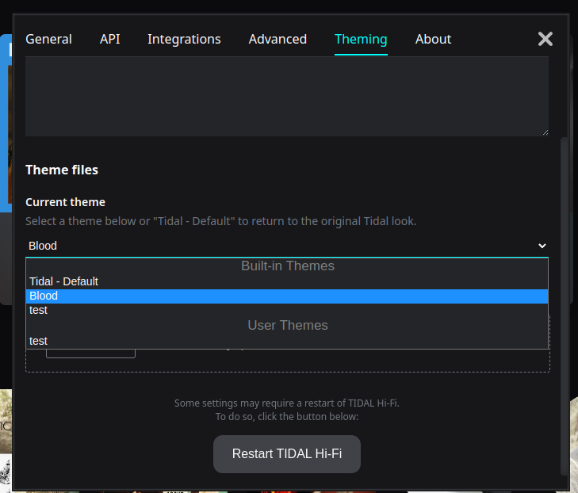
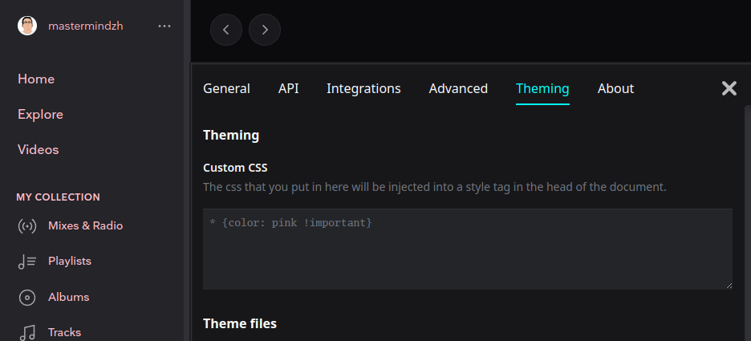

# Theming tidal-hifi

## Table of contents

<!-- toc -->

- [Theming tidal-hifi](#theming-tidal-hifi)
  - [Table of contents](#table-of-contents)
  - [Custom CSS](#custom-css)
  - [config](#config)
  - [Warning! Themes might break](#warning-themes-might-break)

<!-- tocstop -->

By default tidal-hifi comes with a few themes.
You can select these in the settings window under the theming tab as shown below.

## Custom CSS

The custom CSS will be added to the HTML document last.
This means that it will overwrite any existing CSS, even that of themes, unless the original has an access modifier such as `$important`.

## config

The theme selector and customCSS are stored in the config file.
The custom CSS is stored as a list of lines.

## Warning! Themes might break

Themes might break at any point. Tidal changes their webpage structure a ton (they probably generate classNames and don't provide roles/ids/attributes.)

If one breaks you can create an Issue on GitHub or ask for assistance in the [Discord channel](https://discord.gg/yhNwf4v4He).
